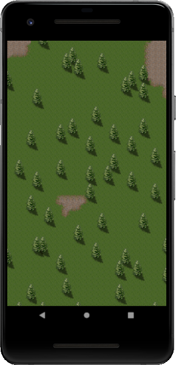

# MonoGame Tutorial
Repositório com o exemplo do artigo **MonoGame - Renderizando Mapa Criado no Tiled** publicado no [Medium](https://medium.com/@ronildo.souza/monogame-renderizando-mapa-criado-no-tiled-5a362c69c914)

-----

  

